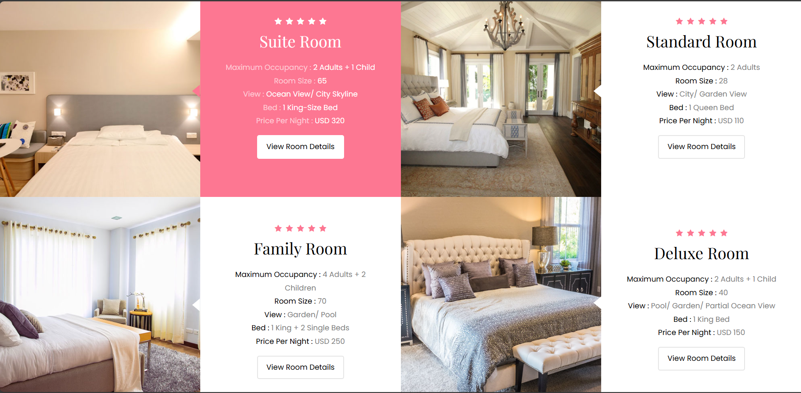

# 🏨 Vacation Rental & Hotel Booking System

A comprehensive hotel booking management system built with PHP, MySQL, and modern web technologies. This platform provides a seamless experience for both guests and hotel administrators with robust booking functionality, payment integration, and complete administrative control.



## ✨ Features Overview

### 🌟 Guest Experience (Frontend)

- **🏠 Room Browsing**: Interactive room gallery with detailed information
- **📅 Real-time Booking**: Smart date selection with availability checking
- **💳 Secure Payments**: PayPal integration for safe transactions
- **📱 Responsive Design**: Mobile-friendly interface across all devices
- **🗺️ Interactive Maps**: Google Maps integration for location services
- **⭐ Guest Reviews**: Authentic testimonials and feedback system
- **🔐 User Accounts**: Secure registration, login, and booking history

### 🛠️ Admin Panel (Backend)

- **📊 Dashboard**: Comprehensive analytics and booking overview
- **🏨 Hotel Management**: Create, update, and manage hotel properties
- **🛏️ Room Management**: Room inventory with pricing and amenities
- **📋 Booking Control**: View, approve, and manage all reservations
- **👥 User Management**: Guest account administration
- **💰 Payment Tracking**: Financial reporting and transaction monitoring
- **🎛️ Utilities Management**: Amenities and services configuration

---

## 🚀 Quick Start Guide

### Prerequisites

- **XAMPP/WAMP/LAMP** (Apache, MySQL, PHP 7.4+)
- **Web Browser** (Chrome, Firefox, Safari, Edge, brave)
- **PayPal Developer Account** (for payment integration)

### Installation Steps

1. **Clone or Download**

   ```bash
   git clone https://github.com/your-username/hotel-booking-system.git
   cd hotel-booking-system
   ```

2. **Database Setup**

   ```sql
   -- Create database
   CREATE DATABASE hotel_booking;

   -- Import database structure (run in phpMyAdmin or MySQL client)
   -- Import the provided SQL file with tables and sample data
   ```

3. **Configuration**

   ```php
   // Edit config/config.php
   $servername = "localhost";
   $username = "root";
   $password = "";
   $dbname = "hotel_booking";
   ```

4. **Start Development Server**
   ```bash
   # Start XAMPP
   # Place project in htdocs folder
   # Access: http://localhost/hotel-booking/
   ```

---

## 🏗️ System Architecture

### Frontend Structure

```
├── index.php                 # Homepage with featured hotels
├── about.php                 # Company information and mission
├── services.php              # Amenities and services showcase
├── contact.php               # Contact form with interactive map
├── rooms/
│   ├── room-single.php       # Individual room details & booking
│   └── pay.php               # PayPal payment processing
├── auth/
│   ├── login.php             # User authentication
│   ├── register.php          # New user registration
│   └── logout.php            # Session termination
└── users/
    └── bookings.php          # User booking history
```

### Admin Panel Structure

```
admin-panel/
├── index.php                 # Admin dashboard
├── admins/
│   └── login-admins.php      # Admin authentication
├── hotels-admins/
│   ├── create-hotels.php     # Add new hotels
│   ├── update-hotels.php     # Edit hotel information
│   └── status-hotels.php     # Manage hotel status
└── rooms-admins/
    ├── create-rooms.php      # Add new rooms
    ├── update-rooms.php      # Edit room details
    └── show-rooms.php        # Room inventory overview
```

---

## 🎨 Design Features

### Modern UI/UX

- **Light pink Theme**: Professional color scheme with CSS variables
- **Responsive Grid**: Bootstrap-based layout for all screen sizes
- **Smooth Animations**: CSS transitions and hover effects
- **Icon Integration**: Flaticon fonts and SVG support
- **Interactive Elements**: Dynamic forms and real-time validation

### Visual Components

- **Hero Sections**: Stunning background images with overlay text
- **Service Cards**: Feature highlights with professional descriptions
- **Testimonial Carousel**: Rotating customer feedback display
- **Interactive Maps**: Embedded Google Maps for location services
- **Image Galleries**: Room showcase with high-quality photos

---

## 💾 Database Schema

### Core Tables

```sql
-- Hotels table
hotels: id, name, description, location, image, status, created_at

-- Rooms table
rooms: id, name, price, num_persons, num_beds, size, view,
       hotel_name, hotel_id, status, image, created_at

-- Bookings table
bookings: id, user_id, hotel_name, room_name, email, full_name,
          phone_number, check_in, check_out, status, payment, created_at

-- Users table
users: id, username, email, password, created_at

-- Utilities/Amenities table
utilities: id, room_id, name, description, icon, created_at

-- Admins table
admins: id, adminname, email, password, created_at
```

---

## 🔧 Technical Specifications

### Backend Technologies

- **PHP 7.4+**: Server-side programming
- **MySQL 5.7+**: Database management
- **PDO**: Secure database connections with prepared statements
- **Sessions**: User authentication and state management
- **Password Hashing**: Secure user credential storage

### Frontend Technologies

- **HTML5 & CSS3**: Modern markup and styling
- **JavaScript (ES6+)**: Interactive functionality
- **Bootstrap 4**: Responsive framework
- **jQuery**: DOM manipulation and AJAX
- **Font Awesome**: Icon library
- **Flaticon**: Custom hotel-specific icons

### Security Features

- **SQL Injection Protection**: Prepared statements throughout
- **XSS Prevention**: Input sanitization with htmlspecialchars()
- **CSRF Protection**: Session-based form validation
- **Password Security**: PHP password_hash() and password_verify()
- **Input Validation**: Server-side data validation

---

## 💳 Payment Integration

### PayPal Integration

```javascript
// PayPal Buttons configuration
paypal
  .Buttons({
    createOrder: function (data, actions) {
      return actions.order.create({
        purchase_units: [
          {
            amount: {
              value: sessionAmount, // Dynamic pricing from PHP session
            },
          },
        ],
      });
    },
    onApprove: function (data, actions) {
      // Payment success handling
      window.location.href = "booking-confirmation.php";
    },
  })
  .render("#paypal-button-container");
```

### Payment Features

- **Sandbox Testing**: Development environment support
- **Real-time Processing**: Immediate payment confirmation
- **Error Handling**: User-friendly error messages
- **Receipt Generation**: Automated booking confirmations
- **Refund Support**: Administrative refund capabilities

---

## 🛡️ Security Best Practices

### Data Protection

```php
// Example of secure database operations
$stmt = $conn->prepare("SELECT * FROM users WHERE email = :email");
$stmt->execute([':email' => $email]);

// XSS prevention
echo htmlspecialchars($user_input, ENT_QUOTES, 'UTF-8');

// Password security
$hashed_password = password_hash($password, PASSWORD_DEFAULT);
$is_valid = password_verify($input_password, $stored_hash);
```

### Access Control

- **Role-based Access**: Separate admin and user permissions
- **Session Management**: Secure login/logout functionality
- **Input Sanitization**: All user inputs are validated and cleaned
- **File Upload Security**: Restricted file types and validation

---

## 📱 Mobile Responsiveness

### Responsive Breakpoints

```css
/* Desktop First Approach */
@media (max-width: 992px) {
  /* Tablet */
}
@media (max-width: 768px) {
  /* Mobile */
}
@media (max-width: 576px) {
  /* Small Mobile */
}
```

### Mobile Features

- **Touch-friendly Interface**: Optimized button sizes and interactions
- **Fast Loading**: Optimized images and minimal JavaScript
- **Offline Capability**: Progressive Web App features
- **App-like Experience**: Smooth navigation and transitions

---

## 🔧 Configuration Guide

### Environment Setup

1. **Database Configuration** (`config/config.php`)
2. **PayPal Settings** (Sandbox/Production keys)
3. **Email Configuration** (SMTP settings for notifications)
4. **File Upload Limits** (Image size and type restrictions)

### Customization Options

- **Theme Colors**: CSS variables in `css/style.css`
- **Hotel Branding**: Logo and company information
- **Service Offerings**: Amenities and features configuration
- **Pricing Structure**: Room rates and seasonal adjustments

---

## 📊 Admin Panel Features

### Dashboard Analytics

- **Booking Statistics**: Daily, monthly, and yearly reports
- **Revenue Tracking**: Payment summaries and financial insights
- **Occupancy Rates**: Room utilization analytics
- **Guest Demographics**: Customer analysis and trends

### Management Capabilities

- **Content Management**: Hotel descriptions and image updates
- **Inventory Control**: Room availability and pricing management
- **User Administration**: Guest account oversight and support
- **System Settings**: Configuration and maintenance tools

---

## 🚀 Performance Optimization

### Speed Enhancements

- **Database Indexing**: Optimized query performance
- **Image Optimization**: Compressed images for faster loading
- **Caching Strategy**: Browser and server-side caching
- **Minified Assets**: Compressed CSS and JavaScript files

### SEO Optimization

- **Clean URLs**: Search engine friendly routing
- **Meta Tags**: Proper page descriptions and keywords
- **Structured Data**: Rich snippets for better search results
- **Mobile-first Indexing**: Responsive design best practices

---

## 🛠️ Development & Deployment

### Development Workflow

```bash
# Local development setup
git clone [repository]
composer install
npm install
php -S localhost:8000
```

### Production Deployment

- **Server Requirements**: Linux/Windows server with PHP 7.4+
- **SSL Certificate**: HTTPS encryption for secure payments
- **Database Backup**: Regular automated backups
- **Monitoring**: Error logging and performance tracking

---

## 🤝 Contributing

We welcome contributions! Please follow these steps:

1. **Fork the Repository**
2. **Create Feature Branch** (`git checkout -b feature/AmazingFeature`)
3. **Commit Changes** (`git commit -m 'Add AmazingFeature'`)
4. **Push to Branch** (`git push origin feature/AmazingFeature`)
5. **Open Pull Request**

### Code Standards

- **PSR-12 PHP Standards**: Consistent coding style
- **Comment Documentation**: Clear code explanations
- **Security Review**: All contributions security-tested
- **Test Coverage**: Unit tests for new features

---

## 📞 Support & Documentation

### Getting Help

- **GitHub Issues**: Bug reports and feature requests
- **Documentation Wiki**: Detailed setup guides
- **Community Forum**: Developer discussions
- **Email Support**: direct technical assistance

### System Requirements

- **PHP**: Version 7.4 or higher
- **MySQL**: Version 5.7 or higher
- **Apache/Nginx**: Web server configuration
- **SSL Certificate**: Required for production payments

---

## 📄 License & Credits

### License

This project is licensed under the MIT License - see the [LICENSE](LICENSE) file for details.

### Credits

- **Icons**: [Flaticon](https://www.flaticon.com) - Premium icon collection
- **Framework**: [Bootstrap](https://getbootstrap.com) - Responsive CSS framework
- **Maps**: [Google Maps API](https://developers.google.com/maps) - Location services
- **Payments**: [PayPal API](https://developer.paypal.com) - Secure payment processing
- **Fonts**: [Google Fonts](https://fonts.google.com) - Typography resources

---

## 🌟 Future Enhancements

### Planned Features

- **Multi-language Support**: Internationalization capabilities
- **Advanced Search**: Filters for price, amenities, and location
- **Loyalty Program**: Guest rewards and membership tiers
- **Mobile App**: Native iOS and Android applications
- **AI Chatbot**: Automated customer service assistance
- **Social Media Integration**: Sharing and social login options

### API Development

- **RESTful API**: Third-party integration capabilities
- **Webhook Support**: Real-time payment notifications
- **Channel Manager**: Integration with booking platforms
- **CRM Integration**: Customer relationship management tools

---

<div align="center">

**Built with ❤️ for the hospitality industry**

[Demo](http://localhost/hotel-booking) • [Documentation](#) • [Issues](https://github.com/your-username/hotel-booking-system/issues) • [Contribute](#contributing)

</div>

---

_© 2025 Vacation Rental Hotel Booking System. All rights reserved._ 
